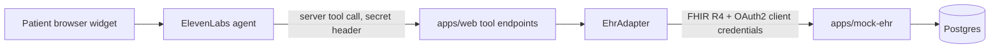

# pokta-clinic

pokta-clinic is a voice agent that runs the pre-visit intake for a private rheumatology practice in Mexico. A Patient talks to an ElevenLabs Agent from a browser widget, and the agent saves what it collects into the practice's EHR over HL7 FHIR R4. The EHR is an external system: in this repo it is a mock vendor called "Expediente Demo" (`apps/mock-ehr`), and any FHIR-speaking EHR with the same Patient and Consent interactions could replace it. This is a take-home demo. All data is fictional. Domain terms (Patient, Practitioner, Organization, Consent, Conversation, EHR, Expediente) are defined in [CONTEXT.md](CONTEXT.md).

A one-page visual of what is built is at [docs/explainers/architecture/index.html](docs/explainers/architecture/index.html) (open it in a browser).

## Architecture

One tool call, end to end. The agent decides to call a server tool (for example `find_patient`) and POSTs JSON to `/api/tools/<name>` on apps/web. The request carries the shared secret in the `x-pokta-tool-secret` header (an ElevenLabs workspace Secret, never shown to the LLM) and a `conversation_id` in the body (the ElevenLabs conversation ID). [handler.ts](apps/web/src/tools/handler.ts) checks the secret, validates the body with zod, then runs the tool. Tools that read or write Patient data first ask the EHR for the Conversation's latest Consent and stop with `consent_required` unless it was granted; this is enforced in code, not only in the prompt. The tool then calls the `EhrAdapter` ([adapter.ts](apps/web/src/ehr/adapter.ts)), whose FHIR implementation gets an OAuth2 client-credentials token from the EHR and sends FHIR R4 JSON to `/fhir/*`. The mock EHR verifies the bearer JWT, maps FHIR to its NOM-based tables, writes the row, and appends an `audit_event` row (the table is append-only, enforced by a database trigger). The tool returns a short result plus a `message` telling the agent what to do next.

## Repo map

| Path | What lives there |
|---|---|
| [apps/web](apps/web/README.md) | Next.js app (Vercel). The agent's server tool endpoints under `src/app/api/tools/` and the `EhrAdapter`. The home page is still the create-next-app placeholder. |
| [apps/mock-ehr](apps/mock-ehr/README.md) | "Expediente Demo": a Hono + Drizzle + Postgres FHIR R4 server (Render). Own Dockerfile. |
| [packages/fhir](packages/fhir/README.md) | Shared FHIR R4 zod schemas, builders, identifier systems and extension URLs. |
| `agent/` | ElevenLabs agent configuration as code (see [docs/agent.md](docs/agent.md)). |
| [docs](docs/README.md) | ADR, security notes, questionnaire, architecture explainer, runbooks. |
| `scripts/` | Helper scripts. [scripts/tools-smoke.sh](scripts/tools-smoke.sh) exercises the tool endpoints. Deploy helpers are described in [docs/deploy.md](docs/deploy.md). |
| `render.yaml` | Render blueprint for the mock EHR and its Postgres (see [docs/deploy.md](docs/deploy.md)). |
| [docker-compose.yml](docker-compose.yml) | Local Postgres 16 for the mock EHR (host port 5434). |
| [CONTEXT.md](CONTEXT.md) | Domain glossary. Use its terms exactly. |

## Quick start (local)

Prerequisites: Node 22, pnpm (the root `packageManager` pins a version; `corepack enable` picks it up), Docker.

1. Start Postgres: `docker compose up -d`. The database is `expediente` on `localhost:5434` (user and password `ehr`).
2. Create env files from the examples (names only; fill the empty values yourself). Use the same `EHR_CLIENT_ID` and `EHR_CLIENT_SECRET` in both app files, and a `TOOL_SECRET` in the web file.
   - `apps/mock-ehr/.env.example` to `apps/mock-ehr/.env.local`: `DATABASE_URL`, `EHR_JWT_SECRET`, `EHR_CLIENT_ID`, `EHR_CLIENT_SECRET`.
   - `apps/web/.env.example` to `apps/web/.env.local`: `EHR_BASE_URL`, `EHR_CLIENT_ID`, `EHR_CLIENT_SECRET`, `TOOL_SECRET`.
   - `.env.example` to `.env.local` (root, only for the agent and Render CLIs): `ELEVENLABS_API_KEY`, `RENDER_API_KEY`.
3. Install: `pnpm install`.
4. Start the EHR: `pnpm dev:ehr` (port 8787). It applies migrations and seeds the demo practice on boot, so `pnpm --filter @pokta-clinic/mock-ehr db:migrate` is optional (it is only useful to migrate without starting the server). `pnpm --filter @pokta-clinic/mock-ehr db:seed` also exists and is idempotent.
5. Start the web app in a second terminal: `pnpm dev:web` (port 3000).
6. Smoke test the tools: `scripts/tools-smoke.sh` (optional base URL argument; reads `TOOL_SECRET` from the environment or from `apps/web/.env.local`). It prints PASS or FAIL per check.

Other root scripts: `pnpm build`, `pnpm typecheck`, and the `agent:*` and `render` scripts (see [docs/agent.md](docs/agent.md) and [docs/deploy.md](docs/deploy.md)).

## Key design decisions

- **NOM-004/NOM-024 inside the EHR, FHIR only at the edge.** Tables follow the Mexican norms; FHIR R4 is the exchange format. The agent's output is a patient-reported document pending the Practitioner's Validation, not the Historia clinica. See [ADR 0001](docs/adr/0001-nom-first-data-model-fhir-at-the-edge.md) and [apps/mock-ehr/docs/data-model.md](apps/mock-ehr/docs/data-model.md).
- **Consent gates reads and writes.** `find_patient` and `save_patient` refuse to run until the Conversation has a granted Consent ([grantedConsent](apps/web/src/tools/handler.ts)). A refusal blocks everything after it.
- **Shared-secret tool auth.** Tool endpoints accept only requests with the `x-pokta-tool-secret` header, compared in constant time. The secret lives in an ElevenLabs workspace Secret and in Vercel env. See [docs/security/elevenlabs-api-keys.md](docs/security/elevenlabs-api-keys.md) for the key scoping.
- **Migrate on boot.** The mock EHR applies Drizzle migrations and seeds the demo practice every time it starts, retrying while Postgres wakes up ([bootstrap.ts](apps/mock-ehr/src/db/bootstrap.ts)).
- **EhrAdapter.** Tools depend only on an interface; pointing at another FHIR EHR is a config change (`EHR_BASE_URL` and credentials), and a non-FHIR EHR is one new implementation ([apps/web/src/ehr/index.ts](apps/web/src/ehr/index.ts)).

## Status

| Built | Planned |
|---|---|
| Mock EHR: Patient (read, search, create) and Consent (create, search, update), OAuth2 token endpoint, CapabilityStatement, append-only audit log | Mock EHR endpoints for Questionnaire, QuestionnaireResponse, Appointment (tables exist; no routes) |
| Tools: `record_consent`, `find_patient`, `save_patient` | Tools: `get_questionnaire`, `save_history`, `check_availability`, `book_appointment`, `escalate` |
| Smoke script, Dockerfile, migrations | Google Calendar, live page, outbox, post-call webhook |

More: [docs/README.md](docs/README.md), [docs/agent.md](docs/agent.md), [docs/deploy.md](docs/deploy.md).
