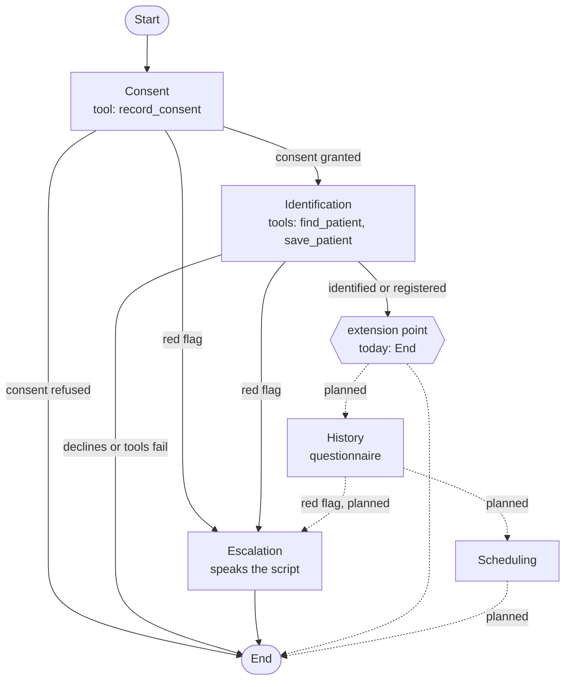

# ElevenLabs agent (configuration as code)

The voice agent is defined by typed source files under `agent/`. A small generator turns them into the files the ElevenLabs CLI pushes. Nothing is edited in the dashboard; the generator is the source of truth.

Status: stages 1 and 2 of the intake (Consent, Identification) plus Escalation. History and Scheduling come next.

## What the agent does

A Spanish (es-MX) voice pre-consultation intake for the fictional "Consultorio de Reumatologia Dra. Elena Ruiz". It opens by saying it is an AI assistant, reads a short aviso de privacidad (LFPDPPP), asks for express consent, then identifies the caller by phone number (existing patient, or registers a new one). It never diagnoses, gives dosage or treatment advice, or reassures about symptoms. A red flag (Emergencia or Urgencia) interrupts everything and ends the call with the escalation script, never with an appointment. If the caller speaks English it switches to English.

## Workflow

Solid lines are built. Dashed lines are planned: History and Scheduling come next, and an `escalate` tool will replace the spoken-only Escalation node. The extension point is the constant `AFTER_IDENTIFICATION` in `agent/src/workflow.ts`: add the History node, point the constant at it, and chain Scheduling from History.

Tools are attached per node (Consent only sees `record_consent`, Identification sees `find_patient` and `save_patient`), so the model cannot reach patient data before Consent. The web app enforces the same rule server side. Escalation edges are listed first on each node so they are evaluated first.

## File map

| Path | What it is |
|---|---|
| `agent/config.json` | Owner decisions that are not secrets: LLM, TTS model, voice ID, origin allowlist, tool timeout, and the workspace secret's name and ID. |
| `agent/src/prompts/base.md` | Shared system prompt (Personality, Environment, Tone, Goal, Guardrails, Red flags, Escalation script). Nodes append to it. |
| `agent/src/prompts/consent.md`, `identification.md`, `escalation.md` | One file per node, appended to the base prompt for that node only. |
| `agent/src/prompts/first-message.md`, `first-message.en.md` | First message (AI disclosure) in Spanish, and the English preset used when the caller switches language. |
| `agent/src/tools/*.ts` | One module per tool: name, when-to-call description, body schema. `index.ts` turns a spec into a webhook tool for a base URL. |
| `agent/src/workflow.ts` | Nodes and edges, including the LLM conditions and the extension point. |
| `agent/src/agent.ts` | Conversation settings (LLM, TTS, ASR keywords, turn eagerness, language presets) and platform settings (allowlist, data collection, evaluation). |
| `agent/src/build.ts` | The generator. Requires `POKTA_WEB_URL`. Writes `agent/cli/`. Keeps IDs the CLI already wrote. |
| `agent/src/validate.ts` | Checks the generated files against ElevenLabs' OpenAPI spec (enums, node types, edge conditions). |
| `agent/scripts/create-tool-secret.ts` | Creates the workspace secret and records its ID. Writes to ElevenLabs; run once, deliberately. |
| `agent/cli/` | Generated, committed. This is the CLI project: `agents.json`, `tools.json`, `agent_configs/`, `tool_configs/`. Do not edit by hand. |

Generated files are committed so a pull request shows exactly what will be pushed. After the first push the CLI writes the platform IDs into `agent/cli/agents.json` and `tools.json`; commit those too, and the generator preserves them on every rebuild.

## Edit a prompt and push

Edit the markdown or TypeScript under `agent/src/`, then, from the repo root, with `POKTA_WEB_URL` set in `.env.local` (the https origin of the web app, no path):

| Step | Command | What it does |
|---|---|---|
| 1 | `pnpm agent:push` | Dry run: build, validate, then `elevenlabs agents push --dry-run`. Nothing is sent. |
| 2 | `git diff agent/cli` | Review exactly what changed. |
| 3 | `pnpm agent:push:apply` | Strict build (fails on a missing secret ID, tool ID or an example URL), validate, push. |

`pnpm agent:build` only regenerates. `pnpm typecheck` includes the agent sources. Note that the CLI's own `--dry-run` is local only and prints "Would update"; the real check is `pnpm agent:validate`, which compares the files to the live OpenAPI spec.

### First-time apply sequence

1. Deploy the web app and set the same `TOOL_SECRET` there. Put `POKTA_WEB_URL` in `.env.local`, and `TOOL_SECRET` in `.env.local` or `.env.production.local`.
2. Add the chosen voice to the workspace (see Voice). Library voices are not in the workspace until added.
3. `pnpm agent:secret --dry-run`, then `pnpm agent:secret`. Creates the workspace secret `tool_secret` and writes its ID into `agent/config.json`. It never prints the value and refuses to create a duplicate.
4. `pnpm agent:tools:push`, then `pnpm agent:tools:push:apply`. Creates the three tools and writes their IDs into `agent/cli/tools.json`.
5. `pnpm agent:push`, then `pnpm agent:push:apply`. Creates the agent (the first push has no ID, so it creates) and writes the agent ID into `agent/cli/agents.json`.
6. Commit `agent/config.json` and `agent/cli/`.

Tools must be pushed before the agent: the workflow references tools by platform ID, and IDs only exist after the tools are created. The dry runs build with placeholder IDs (`PENDING_...`); the apply scripts refuse to run with placeholders.

## How tools authenticate

Each tool is a `POST` to `${POKTA_WEB_URL}/api/tools/<name>` with a JSON body.

| Part | How it is set |
|---|---|
| Secret header | `x-pokta-tool-secret` with value `{ "secret_id": "<id>" }`, a reference to the workspace secret `tool_secret`. The value never reaches the LLM or the repo. The web app compares it with `TOOL_SECRET`. |
| `conversation_id` | A body property with `dynamic_variable: "system__conversation_id"`. The platform fills it; the LLM neither sees nor supplies it. |
| Other fields | LLM-filled from each property's description (for example `granted`, `phone`, `nombre`). |
| Timeout | 10 seconds (`tool_timeout_secs`). |

The tool responses carry a `message` field; the base prompt tells the agent to read it and follow it.

## Model, voice and ASR choices

| Setting | Choice | Why |
|---|---|---|
| LLM | `gemini-3.5-flash`, reasoning effort `low`, temperature 0.3 | Current (not deprecated) Flash-class model in the workspace's LLM list, low latency for a voice loop, and enough reasoning to classify red flags and follow edge conditions. Alternative of the same class: `gpt-5.4-mini`. |
| TTS model | `eleven_v4_turbo` | It exists in `GET /v1/models` ("fastest and most emotive, optimized for low latency, 90+ languages"), so no substitution was needed. Fallback if it misbehaves: `eleven_flash_v2_5`. |
| Speech to text | `scribe_realtime`, keywords for rheumatology terms and Mexican insurers | Keyword list is `ASR_KEYWORDS` in `agent/src/agent.ts` (GNP, AXA, MetLife, Seguros Monterrey, Allianz, artritis reumatoide, lupus, metotrexato and others). |
| Turn eagerness | `patient` | Callers dictate phone numbers and dates with pauses; a patient agent does not cut them off. |
| Language | `es`, with an `en` preset and the language detection tool | Starts in Spanish, switches when the caller speaks English. |
| Access | Auth off, origin allowlist | Allowlist is `localhost`, `localhost:3000` and the host of `POKTA_WEB_URL`, plus anything in `config.json`. |

### Voice shortlist (es-MX, conversational, from the shared voice library)

| Voice | ID | Character | Default |
|---|---|---|---|
| Ana Maria, calm, natural and clear | `m7yTemJqdIqrcNleANfX` | Young woman, built for AI agents, most used in its class | Yes |
| Susana Elizabeth, warm, soft and clear | `cAvMBIZ0VNTU8XdsUpEq` | Young woman, expressive and warm | |
| Jorge, neutral Latin American Spanish | `Rt1JHkPO27QCUX6Nd5bV` | Mature man, professional, raspy | |

To switch, change `voice_id` in `agent/config.json` and push. None of the three is in the workspace yet (`GET /v1/voices/<id>` returns not found). Add the chosen one first, in the dashboard (Voices, Add to my voices) or with `POST /v1/voices/add/<public_owner_id>/<voice_id>`. The public owner IDs are in the shared-voices API response (`GET /v1/shared-voices?language=es&accent=mexican&use_cases=conversational`). The current key is scoped for `voices_read` only, so the API route needs a key with `voices_write`.

## Decisions the owner still has to make

| Item | Where | Note |
|---|---|---|
| Voice | `agent/config.json` `voice_id` | Pick from the shortlist, then add it to the workspace. |
| Web app URL | `POKTA_WEB_URL` | The Vercel production origin. The dry run in the repo used a placeholder. |
| Aviso de privacidad wording | `agent/src/prompts/consent.md` | A short summary written for the demo; have the final text reviewed. It does not yet mention that a third-party voice platform processes the call. |
| Recording and retention | `platform_settings.privacy` (not set) | Defaults apply: voice is recorded, no retention limit. For health data decide on `record_voice`, `retention_days` or zero retention. |
| Practice phone number | prompts | The agent says "the practice will call you back" because no number is defined. Add one if the callback line should be spoken. |
| Extra allowlist hosts | `agent/config.json` `allowlist` | Add custom domains and preview hosts if used. Whether ports are part of the host match (`localhost:3000`) was not verified. |

## How the CLI layout works

The CLI (`@elevenlabs/cli` 1.4.0, a Rust binary) works on the directory it runs in, which for us is `agent/cli/`. The root scripts `cd` there.

| File | Role |
|---|---|
| `agents.json` | Registry of agents: `config` path and, once pushed, `id`. An entry without an `id` is created on push. |
| `agent_configs/<name>.json` | The body of the API's create or update agent call, pushed verbatim: `conversation_config`, `platform_settings`, `workflow` (top level, not inside `conversation_config`), `name`, `tags`. |
| `tools.json` | Registry of tools: `type`, `config` path, and `id` after `tools push`. |
| `tool_configs/<name>.json` | The `tool_config` of a webhook tool: `name`, `description`, `api_schema` (url, method, headers, body schema). |

Tools are separate objects with their own IDs. An agent references them by ID: globally in `conversation_config.agent.prompt.tool_ids`, or per workflow node in `additional_tool_ids` (what we use). The CLI does not resolve names to IDs, which is why the generator reads the IDs back from `tools.json`.

Other behaviours worth knowing: `push` force-overrides the remote agent with the local file; `agents pull` can import a dashboard edit but the next `agent:build` will overwrite it; `tools add` ignores `--dry-run` and creates the tool, so use `tools push` instead (what the scripts do).

## Doc findings that differ from the design note

| Design note | What the docs and spec say | What we did |
|---|---|---|
| Header value references the secret as `secret__tool_secret` | Webhook header values accept `{ "secret_id": "..." }` (a workspace secret, by ID, not name). The `secret__` prefix is for per-conversation secret dynamic variables supplied by the client at start, which a public widget cannot hold safely. | Header uses the workspace secret ID; `agent:secret` creates it and records the ID. |
| Workflow lives in `conversation_config.workflow` (docs example) | The API body and the CLI use a top-level `workflow`. | Top-level `workflow`. |
| CLI `--dry-run` validates the push | It is local only and does not check the schema; the CLI's embedded spec lags the API (no `eleven_v4_turbo`). | `agent:validate` checks against the live OpenAPI spec. |
| Allowlist is a list of hosts | Each entry is an object, `{ "hostname": "..." }`. | Generated that way. |
