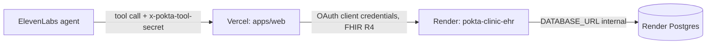

# Deploy runbook

Production runs the mock EHR and its Postgres on Render and the web app (agent tool endpoints) on Vercel. Config as code lives in `render.yaml` (Render Blueprint); Vercel needs no config file, only project settings.

## What runs where

| Piece | Platform | Name | Notes |
|---|---|---|---|
| Mock EHR (Hono, FHIR R4) | Render web service, Docker | `pokta-clinic-ehr` | `apps/mock-ehr/Dockerfile`, context = repo root, health check `/healthz`, ohio |
| Postgres | Render Postgres | `pokta-clinic-ehr-db` | ohio, same region as the EHR, internal connection string only |
| Web app + tool endpoints | Vercel | `pokta-clinic-web` (team poktalabs) | Root Directory `apps/web`, framework Next.js 16, pnpm workspace |
| Voice agent | ElevenLabs | n/a | Calls `https://<web>/api/tools/*` with header `x-pokta-tool-secret` |

Service and database names are referenced by the suspend/resume feature through the Render API, so do not rename them.

## Current production

Deployed 2026-10-05. IDs and URLs are not secrets; values of secrets live only in the platforms and in `.env.production.local`.

| Piece | URL or ID | How it was created |
|---|---|---|
| GitHub repo | `poktalabs/pokta-clinic` (private) | `gh repo create --private --push` |
| Render Postgres | `dpg-db27i6bbc2fs73fi6td0-a`, free plan, ohio, expires 2026-11-05 | Render API `POST /v1/postgres` |
| Render EHR | `srv-db27nqek1f9s739ei9cg`, https://pokta-clinic-ehr.onrender.com, auto-deploys on push to `main` | Render API `POST /v1/services` with the same settings as `render.yaml` |
| Vercel web | project `pokta-clinic-web` (team poktalabs), https://pokta-clinic-web.vercel.app | `vercel link`, root directory set through the Vercel API, `vercel deploy --prod` |
| ElevenLabs | agent `agent_1701m47rjpwcfqasqaw19hph7qb4`, secret `tool_secret`, 3 tools | `pnpm agent:secret`, `pnpm agent:tools:push:apply`, `pnpm agent:push:apply` (see [agent.md](agent.md)) |

Two differences from the generic steps below. First, the Render resources were created through the API, not as a Blueprint, so `render.yaml` is the reference definition and the rebuild path, not a synced Blueprint: a change to it does not apply itself. Second, Vercel is not connected to GitHub (its GitHub app has no access to the poktalabs org), so the web app deploys only with `vercel deploy --prod` from the repo root. Grant that access in Vercel to get deploys on push.

## Environment variables

No values here. Generate the three shared secrets once with `scripts/gen-secrets.sh` (writes `.env.production.local`, gitignored, mode 600).

| Name | Set in | Generated by | Purpose |
|---|---|---|---|
| `DATABASE_URL` | Render (EHR) | Render, via `fromDatabase` in `render.yaml` | Postgres connection for the EHR |
| `EHR_JWT_SECRET` | Render (EHR) | Render, `generateValue` | Signs EHR access tokens; never leaves Render |
| `EHR_CLIENT_ID` | Render (EHR) and Vercel | `scripts/gen-secrets.sh` | OAuth client id; must match on both sides |
| `EHR_CLIENT_SECRET` | Render (EHR) and Vercel | `scripts/gen-secrets.sh` | OAuth client secret; must match on both sides |
| `EHR_BASE_URL` | Vercel | You, after Render is live | Public URL of `pokta-clinic-ehr`, for example `https://pokta-clinic-ehr.onrender.com` |
| `TOOL_SECRET` | Vercel and ElevenLabs agent secret | `scripts/gen-secrets.sh` | Shared secret on the `x-pokta-tool-secret` header of agent tool calls |
| `CALENDAR_PROVIDER` | Vercel | You | `google` in production (also the default). `fake` is refused on Vercel production |
| `GOOGLE_SERVICE_ACCOUNT_KEY_B64` | Vercel | Google Cloud, you encode it | Base64 of the service account JSON key; never generated by or passed through chat |
| `GOOGLE_CALENDAR_ID` | Vercel | Google Calendar | Id of the Practitioner's calendar (calendar settings, Integrate calendar) |
| `PORT` | Render | Render (injected) | Listen port; the server reads it |
| `STORE_PROVIDER` | Vercel | You | `upstash` (also the default). `memory` is refused on Vercel production |
| `KV_REST_API_URL`, `KV_REST_API_TOKEN` | Vercel | Upstash, injected by the Marketplace integration | The store's REST credentials. The integration can inject `UPSTASH_REDIS_REST_URL` and `UPSTASH_REDIS_REST_TOKEN` instead; the app reads either pair |
| `ADMIN_PASSWORD` | Vercel | You (long and random) | Admin login for the EHR toggle, outbox drain and conversation records |
| `ADMIN_SESSION_SECRET` | Vercel | You (optional, random) | Signs the admin cookie; without it the key derives from `ADMIN_PASSWORD` |
| `CRON_SECRET` | Vercel | You (random, at least 16 characters) | Vercel Cron sends it as a bearer token to `/api/outbox/drain` |
| `RENDER_API_KEY` | Vercel | Render, account settings | EHR on/off toggle. Account-wide, see the risk note below |
| `RENDER_EHR_SERVICE_ID` | Vercel | This file | `srv-db27nqek1f9s739ei9cg` |
| `RENDER_EHR_POSTGRES_ID` | Vercel | This file | `dpg-db27i6bbc2fs73fi6td0-a` |
| `ELEVENLABS_WEBHOOK_SECRET` | Vercel | ElevenLabs, when the webhook is created | Verifies the post-call webhook signature |
| `NEXT_PUBLIC_ELEVENLABS_AGENT_ID` | Vercel | This file | Agent id for the widget on `/`. Public by design; baked in at build time, so redeploy after changing it |

## Store (Upstash Redis)

pokta-clinic keeps its own small store so it keeps working while the EHR is switched off: tool timeline, Consent cache, outbox, post-call records. All of it expires after 7 days. Without it the live page, the outbox and the consent gate fail closed.

1. Vercel dashboard, project `pokta-clinic-web`, Storage (or Marketplace), add Upstash Redis (Upstash for Redis), pick a region close to the Vercel functions and the free plan. Connect it to the project for Production, Preview and Development as needed.
2. The integration injects the REST credentials as `KV_REST_API_URL` and `KV_REST_API_TOKEN` (and possibly `UPSTASH_REDIS_REST_URL` and `UPSTASH_REDIS_REST_TOKEN`). The app reads either pair; check with `vercel env ls` and never print the values.
3. Leave `STORE_PROVIDER` unset or set it to `upstash`. Do not set `memory` on Vercel: it is refused in production because each function instance would have its own copy.
4. Redeploy, then open the page: the tool timeline shows "No tool calls yet" instead of "Reconnecting".

Data note: outbox payloads (queued answers and Red flag words) and post-call transcripts sit in this Redis until they expire. In the demo they are fictional. For a real practice the store would need its own review (region, encryption, retention) under the same LFPDPPP rules as the EHR.

## Outbox, cron and the EHR toggle

- Outbox: while the EHR is off, `save_history`, the Appointment write of `book_appointment`, `escalate` and `record_consent` queue in the store and the call continues; `find_patient` and `save_patient` still fail with the apology message because they cannot work without the EHR. See [apps/web/README.md](../apps/web/README.md#outbox-ehr-outages).
- Drain triggers: the Turn on button (the drain starts once the page first sees the EHR healthy), the Drain button (`POST /api/outbox/drain`, admin only), and Vercel Cron.
- Cron: [apps/web/vercel.json](../apps/web/vercel.json) calls `GET /api/outbox/drain` every 10 minutes. Vercel sends `Authorization: Bearer $CRON_SECRET` when the `CRON_SECRET` env var exists, and the route refuses anything else. Cron only runs on production deployments. Check the plan: Hobby accounts are limited to one cron run per day and Vercel rejects a deployment whose schedule is more frequent, so on Hobby change the schedule to a daily one (for example `0 6 * * *`) and rely on the buttons for the rest.
- Toggle: the admin buttons on the page call `POST /api/admin/ehr`, which calls the Render API (resume: database, then service; suspend: service, then database). A resumed free EHR needs a minute or more to boot, so the page shows `waking` meanwhile. Suspending the Postgres ends the free-database clock only if Render treats it that way; check the Render dashboard.
- Risk: `RENDER_API_KEY` is an account-wide key (Render API keys have the full permissions of the user, across every workspace the user belongs to; there is no per-service scope). Anyone who gets it from the Vercel env can deploy, change or delete anything in the account. Use a dedicated Render account or workspace that holds only these two resources if you can, never put the key in the browser, `NEXT_PUBLIC_*` or logs, rotate it from Render's account settings and replace it in Vercel (`vercel env rm` then `vercel env add`) after any suspected leak, and remember the toggle is only as safe as `ADMIN_PASSWORD`.

## Post-call webhook (ElevenLabs)

The webhook stores each finished Conversation's transcript and analysis in the store, as fallback evidence if a reviewer cannot open a Conversation ID from another workspace. It is created by hand; nothing in this repo creates it.

1. ElevenLabs, Agents platform settings (https://elevenlabs.io/app/agents/settings), Post-call webhooks.
2. Create a webhook with the URL `https://pokta-clinic-web.vercel.app/api/webhooks/elevenlabs`, auth method HMAC.
3. Copy the signing secret ElevenLabs shows once, and set it in Vercel as `ELEVENLABS_WEBHOOK_SECRET` (`vercel env add ELEVENLABS_WEBHOOK_SECRET production`, paste on stdin). Redeploy.
4. Enable transcript events for the workspace (post-call transcription).
5. Make a test call. Within a minute, log in as admin and open `GET /api/live/conversations`; the Conversation appears. A 401 in the ElevenLabs webhook log means the secret differs; a 503 means `ELEVENLABS_WEBHOOK_SECRET` is not set on the deployment.

Signature scheme (from the ElevenLabs SDK `constructEvent`; the docs page names the header only): `ElevenLabs-Signature: t=<unix seconds>,v0=<hex>`, `v0 = HMAC-SHA256(secret, "<t>.<raw body>")`, 30 minute tolerance.

## Google Calendar for scheduling

`check_availability` and `book_appointment` read and write the Practitioner's Google Calendar through a service account. Without these variables they fail closed: the call errors (HTTP 500) instead of using a fake calendar.

1. In Google Cloud, create a service account in a project with the Calendar API enabled, and download its JSON key to a local file outside the repo (for example `~/Downloads/pokta-calendar-key.json`).
2. In Google Calendar, share the Practitioner's calendar with the service account's email (`client_email` in the key), permission "Make changes to events".
3. Copy the calendar id from the calendar's settings (Integrate calendar).
4. Set the Vercel variables without the key passing through chat or a terminal echo. The key goes from the file to Vercel's stdin only:
   - `base64 < ~/Downloads/pokta-calendar-key.json | tr -d '\n' | vercel env add GOOGLE_SERVICE_ACCOUNT_KEY_B64 production`
   - `vercel env add GOOGLE_CALENDAR_ID production` (paste when prompted)
   - `echo google | vercel env add CALENDAR_PROVIDER production`
5. Deploy (`vercel deploy --prod`), delete the local key file, and run the smoke test. Rotating the key means creating a new one in Google Cloud, replacing the variable the same way, redeploying and deleting the old key.

The smoke test books a real first consultation for a throwaway patient in that calendar, so run it against production with `SMOKE_SKIP_BOOKING=1` unless you want the event, or delete the event afterwards. Locally, set `CALENDAR_PROVIDER=fake` in `apps/web/.env.local` (the fake calendar lives in the server process).

## First deploy

1. Generate secrets: `scripts/gen-secrets.sh`. Read values from `.env.production.local` only when pasting into a dashboard prompt.
2. Push the repo to a private GitHub repo and connect it to Render (Dashboard, Account Settings, GitHub, authorize the repo).
3. Render Dashboard, New, Blueprint, pick the repo and branch. Render reads `render.yaml`, creates `pokta-clinic-ehr-db` and `pokta-clinic-ehr`, and prompts for `EHR_CLIENT_ID` and `EHR_CLIENT_SECRET` (the `sync: false` vars). Paste them from `.env.production.local`. The Render API has no endpoint to create a Blueprint, so this step is dashboard only. Validate the file beforehand with `pnpm render blueprints validate ./render.yaml`.
4. Wait for the first deploy. Migrations and the demo seed run on boot with retry. Note the service URL.
5. Link Vercel from `apps/web`: `cd apps/web && vercel link --yes --project pokta-clinic-web`. In the project settings set Root Directory to `apps/web` if the link did not infer it (needed so Vercel sees the pnpm workspace and `packages/fhir`; keep "Include source files outside of the Root Directory" enabled, the default). `transpilePackages` in `next.config.ts` already covers `@pokta-clinic/fhir`.
6. Add env vars, each prompts for the value on stdin: `vercel env add EHR_BASE_URL production`, then the same for `EHR_CLIENT_ID`, `EHR_CLIENT_SECRET`, `TOOL_SECRET`. To avoid echoing, pipe from the file: `grep '^TOOL_SECRET=' ../../.env.production.local | cut -d= -f2- | vercel env add TOOL_SECRET production`.
7. Deploy: `vercel deploy --prod` (or push to the connected branch).
8. Set the ElevenLabs agent secret for the tool header to the exact value of `TOOL_SECRET`, and point the tool URLs at `https://<web>/api/tools/*`, then `pnpm agent:push`.
9. Verify (next section).

## Verification

`scripts/deploy-check.sh https://<ehr-host> https://<web-host>` checks EHR `/healthz` and `/fhir/metadata`, then runs `scripts/tools-smoke.sh` against the web URL (see the Google Calendar section for `SMOKE_SKIP_BOOKING`). `TOOL_SECRET` is read from the environment, else `.env.production.local`. The free EHR spins down when idle, so the first probe can take about a minute. The smoke test writes a throwaway patient into the production demo database.

## Redeploy

Render redeploys on every commit to the connected branch (`autoDeployTrigger: commit`); manual: `pnpm render deploys create <service-id>`. Vercel deploys on push to the connected branch or with `vercel deploy --prod`. Schema changes ship as drizzle migrations in `apps/mock-ehr/drizzle`, applied on boot.

## Rotating secrets

1. `scripts/gen-secrets.sh --force` (new file, new values).
2. `EHR_CLIENT_ID` and `EHR_CLIENT_SECRET`: update in Render (service, Environment) and in Vercel (`vercel env rm` then `vercel env add`), then redeploy both. Between the two redeploys, tool calls fail; do both back to back.
3. `TOOL_SECRET`: update in Vercel, redeploy, then update the ElevenLabs agent secret to the same value.
4. `EHR_JWT_SECRET`: change in Render (or delete and let the Blueprint regenerate); it invalidates outstanding EHR tokens, which the web app re-fetches on its own.
5. Run `scripts/deploy-check.sh`.

## Cost and free-tier limits

Verified against https://render.com/docs/free on 2026-10-05. Re-check before relying on it.

- Free Postgres expires 30 days after creation: it becomes inaccessible, with a 14-day grace period to upgrade before deletion. 1 GB storage, no backups, no connection pooling, one free database per workspace. Plan: recreate or upgrade before day 30; the data is demo data and reseeds on boot.
- Free web service spins down after 15 minutes without traffic and takes about a minute to restart; the filesystem is ephemeral; 750 free instance hours per workspace per month.
- Vercel Hobby covers the web app; it is for non-commercial use.
- The Blueprint spec page states that the free plan is not available for Docker services. The CLI validator accepted `plan: free`, but if the Blueprint sync rejects it, change the service to the cheapest paid plan (`starter`) in `render.yaml`.

## Rollback

- EHR: Render Dashboard, service, Events or Deploys, Rollback to a previous deploy (or revert the commit and push). Migrations are not rolled back, so keep them backward compatible.
- Web: `vercel rollback` (or promote a previous deployment in the dashboard).
- Database: free Postgres has no backups; the demo seed restores baseline data on an empty database. Delete and recreate it only if the data does not matter.
- Emergency stop: suspend `pokta-clinic-ehr` and `pokta-clinic-ehr-db` (dashboard, or the suspend endpoints of the Render API).
